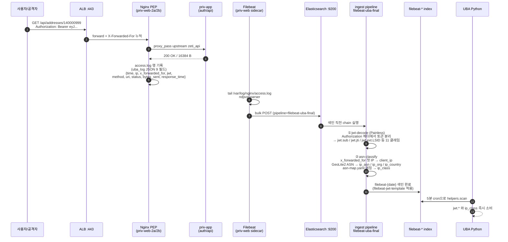
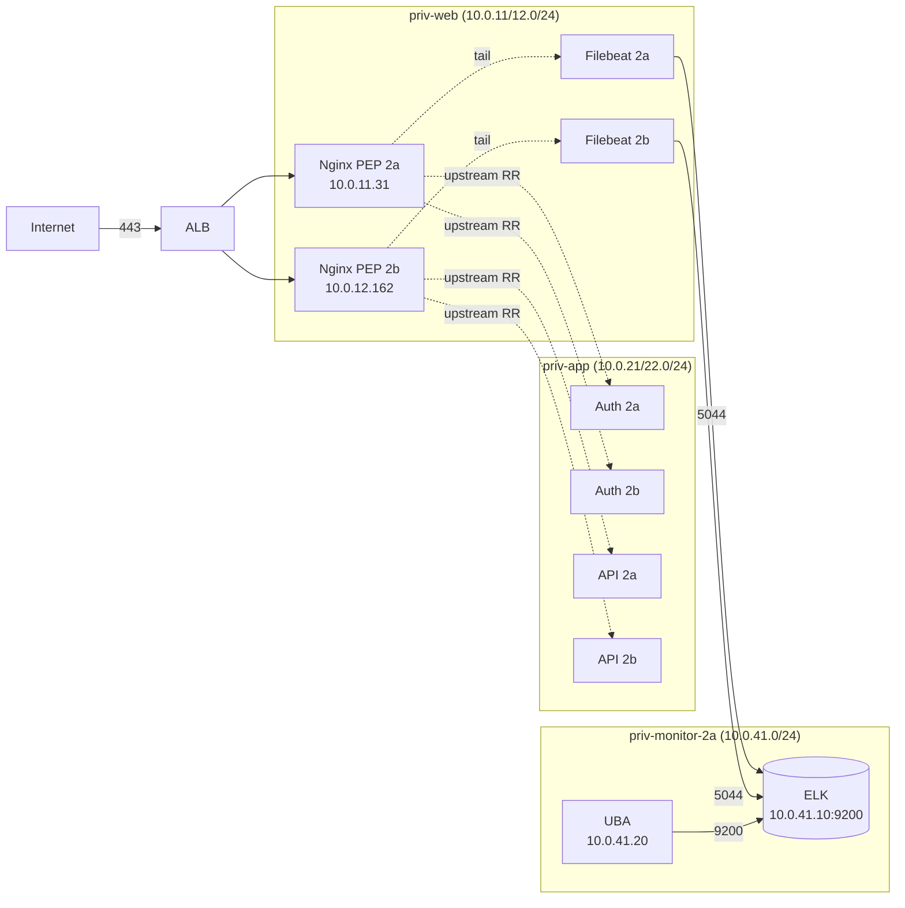
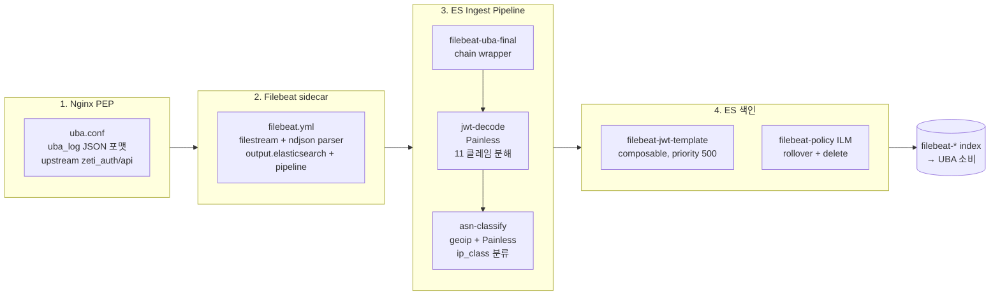

# 📡 ZETI Log Pipeline — Nginx PEP + Filebeat + ES Ingest

> **ZETI (Zero Trust + UBA) — 아주대 캡스톤 / Google × Ajou AI Capstone Design**
> 백엔드 트래픽을 **Nginx PEP → Filebeat → ES ingest pipeline → filebeat-\* 색인**까지 운반하는 _데이터 파이프라인_

[](#)
[](#)
[](#)
[](#)

---

## ⚡ 30초 요약

**ZETI 의 _신경망_** 입니다. 백엔드(`auth/api`)에서 발생한 모든 트래픽이 본 레포가 정의한 **Nginx PEP (priv-web) → Filebeat tail → ES `filebeat-uba-final` ingest pipeline → `filebeat-*` 색인** 경로를 거쳐야 UBA 가 분석할 수 있습니다. ingest pipeline 단계에서 **JWT 11 클레임 분해 (Painless) + ASN 분류 (GeoLite2 + asn-map.yaml)** 가 동시에 일어나, UBA Python 은 사전 파싱된 `jwt.*` / `ip_class` 를 _직접_ 소비합니다.

- 🛡️ **Nginx PEP**: priv-web-2a/2b 양 AZ 단일 conf (`uba.conf`) — upstream 으로 priv-app 양 AZ 통합 라우팅, JSON `uba_log` 9 필드 포맷
- 🧩 **ES Ingest Pipeline 2 단 chain**: `jwt-decode` (Painless로 11 클레임 분해) + `asn-classify` (GeoLite2 ASN → `ip_class` `cgnat_kr/cloud/unknown`)
- 🗂️ **7 ES 매핑**: `filebeat-jwt-template` (입력) + `uba-events / uba-baseline / uba-risk-scores / uba-user-profiles / uba-alerts / uba-intelligence` (UBA 산출)
- 🇰🇷 **CGNAT 화이트리스트**: SKT/KT/LGU+ 등 5 개 ASN — `ip_user_diversity` soft cap 30 (오탐 차단)
- ⚙️ **IaC 전환 예정**: 현재 AWS 콘솔 수기 + `infrastructure/console-changes.md` 기록 → Terraform 이전 예정

> 🎯 **핵심 원칙**: ingest pipeline 단계에서 _분해까지_ 끝낸다. UBA Python 은 `jwt.sub` / `jwt.jti` / `jwt.ext.LSID` / `ip_class` 를 즉시 쓸 수 있게 — Python 파싱 비용 0, schema 일관성 강제.

---

## 🎬 Live Demo — 단일 요청의 여정 (~30초 내 색인)



**총 소요**: 요청 종료 ~5초 후 색인 완료, UBA 가 다음 5분 cron 에서 소비.

---

## 🏗️ 1. AWS 인프라 위치

본 파이프라인은 **priv-web 2a/2b + priv-monitor 2a** 세 서브넷에 걸쳐 있습니다.



### SG 체인

```
alb-sg     ──80──>  nginx-sg
nginx-sg   ──8080/8081──>  app-sg
nginx-sg / app-sg  ──5044──>  elk-sg
uba-sg     ──9200──>  elk-sg
```

> 모든 인바운드는 SG 참조. priv-web 가 양 AZ priv-app 으로 round-robin → cross-AZ ~50% 발생 (시연 단계 수용, IaC 이전 시 정정).

---

## 🔀 2. 4 단 파이프라인 흐름



| 단계 | 산출 | 정의 위치 |
|------|------|----------|
| Nginx access log | JSON 9 필드 | `nginx-pep/uba.conf` (`log_format uba_log`) |
| Filebeat doc | ndjson 평탄화 | `filebeat/filebeat.yml`, `filebeat-priv-web.yml` |
| ingest pipeline | `jwt.*` + `ip_class` 박힌 doc | `es-pipelines/filebeat-uba-final.json` + `asn-classify.json` |
| 색인 | `filebeat-{date}` | `es-mappings/filebeat-jwt-template.json` |

---

## 🧩 3. ES Ingest Pipeline — 2 단 chain 상세

### 3-1. `jwt-decode` (Painless)

Nginx 가 `$http_authorization` 헤더를 통째로 `jwt` 필드에 박아 보내면, Painless 스크립트가 `Bearer ` 분리 → header/payload/signature 셋으로 Base64URL 분해 → JSON 디코드 → **11 클레임을 `jwt.{sub,jti,iat,exp,iss,aud,...,ext.LSID,ext.fiat}` 로 평탄화**.

> v11 분담 변경: jwt-decode 의 Painless 실행은 **Filebeat script processor** 로 일부 이관 (`filebeat-processors-jwt.yml`). ES 측은 `filebeat-uba-final` chain 으로 fallback 보장.

### 3-2. `asn-classify` (geoip + Painless)

```
processors:
  1) script:  x_forwarded_for 콤마 분리 → 첫 IP = client_ip
              (없으면 ip(ALB IP) fallback. 단 ALB IP는 ASN 분류 의미 없음.)
  2) geoip:   GeoLite2-ASN.mmdb → ip_asn (AS<num>) + ip_org
  3) geoip:   GeoLite2-City.mmdb → ip_country (LLM 프롬프트 컨텍스트용)
  4) script:  asn-map.yaml 하드코딩 매칭 → ip_class
              cgnat_kr WHITELIST: AS9644(SKT) / AS4766(KT) / AS17858(LGU+) / AS9318(SKB) / AS3786(LG DACOM)
              cloud: AS16509(AWS) / AS15169(Google) / AS8075(MS) / AS14061(DO) / AS16276(OVH)
              unknown: 매칭 안 됨
  5) script:  is_nat_whitelisted = (ip_class == 'cgnat_kr')
              ip_class_source = 'asn_map_match'
```

**중요 설계 결정** (`asn-classify.json` _meta):
- Painless 가 yaml 동적 로드 불가 → **asn-map.yaml 의 ASN 리스트를 Painless 코드에 정적 박음**. yaml 갱신 시 pipeline 재배포 필요.
- GeoLite2-ASN.mmdb 는 **ES 노드에 수동 배치** (ES 자동 다운로드 대상 아님): `config/ingest-geoip/GeoLite2-ASN.mmdb`
- nginx 의 `ip` 필드 = ALB IP. **ASN 분류에 사용 X**. `x_forwarded_for` 첫 IP 만이 실 사용자 IP.

### 3-3. ip_class 사용처 매트릭스

| consumer | 사용 방식 |
|----------|----------|
| **uba-analyzer P1** `ip_aggregator` | IP별 NAT 메타 carry-over |
| **uba-analyzer P2** `factor_engine` | `ip_user_diversity` soft cap (`min(raw, 30) if ip_class == cgnat_kr`) |
| **uba-analyzer P3a** `orchestrator.py` | LLM 프롬프트 컨텍스트 (NAT 판정 절차 정보) |

### 3-4. soft cap 채택 근거 (vs hard whitelist)

| 옵션 | 동작 | 위험 |
|------|------|------|
| Hard whitelist (cgnat_kr → 0점) | 화이트리스트 IP 는 무조건 0 | 공격자가 cgnat_kr ASN 우회로 무력화 |
| **Soft cap 30 (채택)** | cgnat_kr 도 cap 까지는 점수 가산 | 정상 NAT 알람 차단 + 공격 시 `response_sensitivity` 결합으로 잡힘 |

---

## 🗂️ 4. ES 매핑 7 종 (Option B — strict)

| 매핑 파일 | 색인 | 소유 |
|-----------|------|------|
| `filebeat-jwt-template.json` | `filebeat-*` (composable, priority 500) | **입력** — Nginx access log |
| `uba-events.json` | `uba-events` | uba-analyzer Phase 1 |
| `uba-risk-scores.json` | `uba-risk-scores` | uba-analyzer Phase 2 |
| `uba-user-profiles.json` | `uba-user-profiles` | uba-analyzer Phase 2.5 |
| `uba-alerts.json` | `uba-alerts-{date}` | uba-analyzer Phase 3a (LLM 산출) |
| `uba-intelligence.json` | `uba-intelligence-{date}` | uba-analyzer Phase 3b (LLM 산출) |

**Option B** 정책 (2026-05-23 결정):
- `dynamic: false` — 미선언 필드는 색인되지 않음 (스키마 누수 차단)
- 모든 필드 type 엄격 명시 — keyword / long / date / nested 등
- ES 매핑 변경 시 **alias 재지정 절차** 필수 (`scripts/reset-es-mapping.sh`)

---

## 📦 5. 디렉토리 구조

```
log-pipeline/
├── nginx-pep/                            # 🛡️ Nginx PEP conf (구 nginx-pep 레포 흡수)
│   └── uba.conf                          # 단일 source of truth, priv-web 2a/2b 동일
│
├── filebeat/                             # 📡 Filebeat 사이드카 conf
│   ├── filebeat.yml                      # 메인 conf
│   ├── filebeat-priv-web.yml             # priv-web 전용 오버레이
│   └── filebeat-processors-jwt.yml       # v11 script processor (jwt 분해 Filebeat 측)
│
├── es-pipelines/                         # 🧩 ES ingest pipeline
│   ├── filebeat-uba-final.json           # ★ chain wrapper (jwt-decode + asn-classify)
│   └── asn-classify.json                 # ASN 분류 (geoip + Painless)
│
├── es-mappings/                          # 🗂️ ES 매핑 7 종 (Option B strict)
│   ├── filebeat-jwt-template.json        # composable template, priority 500
│   ├── uba-events.json
│   ├── uba-risk-scores.json
│   ├── uba-user-profiles.json
│   ├── uba-alerts.json
│   └── uba-intelligence.json
│
├── ip-classification/
│   └── asn-map.yaml                      # 🇰🇷 cgnat_kr WHITELIST + cloud / vps 정보
│
├── archive/                              # 폐기된 v10 이전 (jwt-decode.json.bak 등)
│
├── infrastructure/                       # 🏗️ 구 infrastructure 레포 흡수
│   └── console-changes.md                # AWS 콘솔 수기 변경 기록 (Terraform 이전 전)
│
└── scripts/                              # ⚙️ 운영 스크립트
    ├── setup-es-ingest.sh                # ingest pipeline 배포
    ├── setup-es-uba-indices.sh           # uba-* 색인/alias 생성
    ├── deploy-nginx-pep.sh               # priv-web 2a/2b 양쪽 nginx-pep 배포
    ├── reset-es-mapping.sh               # 매핑 변경 시 alias 재지정
    ├── reseed-and-verify.sh              # AMBIG_NAT 코호트 리시드 + 검증
    ├── seed-baseline.py                  # baseline 시드 데이터 박기
    ├── verify_asn_classify.sh            # asn-classify 동작 검증
    ├── verify-jwt-es.sh                  # jwt-decode 동작 검증
    └── test-jwt-curl.sh                  # 합성 JWT 로 curl 테스트
```

---

## 🛠️ 6. Tech Stack

| Category | Stack | 비고 |
|----------|-------|------|
| **PEP** | Nginx 1.24+ | `set_real_ip_from <ALB CIDR>` + `real_ip_recursive on` |
| **Log Shipper** | Filebeat 8.x | filestream input + ndjson parser |
| **Search Engine** | Elasticsearch 8.x | composable template + ILM rollover |
| **Ingest Script** | **Painless** | yaml 동적 로드 불가 → ASN 리스트 정적 박음 |
| **GeoIP** | MaxMind GeoLite2-ASN + GeoLite2-City | 수동 다운로드 + ES 노드 배치 |
| **CI/CD** | GitHub Actions | `push to main → ELK 자동 배포` (pipeline + mapping) |
| **IaC** | Terraform (예정) | 콘솔 수기 → Terraform 이전 시 `infrastructure/console-changes.md` 가 base |

---

## 🧭 7. Why → How → Impact → Deliverable

### 1️⃣ Why — UBA Python 이 "원시 로그" 를 파싱하면 안 되는 이유

| 문제 | 원시 로그 직접 파싱 시 | ES ingest pipeline 분해 후 |
|------|---------------------|---------------------------|
| 스키마 일관성 | 컴포넌트마다 다르게 파싱 | _한 곳_ 에서 정의 → 일관 |
| Python 부하 | 매 doc 마다 JWT base64 디코드 | ES 가 색인 시 1회만 |
| 멀티 소비자 (UBA / Kibana / 외부) | 각자 파싱 코드 중복 | `jwt.*` 필드 그대로 공유 |
| 페이로드 형식 변경 | 모든 소비자 수정 | ingest pipeline 1 곳만 |

### 2️⃣ How — 각 단계의 책임 분리

- **Nginx PEP**: 원본 캡처만 (`uba_log` 9 필드). 파싱 0. `set_real_ip_from` 으로 ALB 신뢰 hop 처리.
- **Filebeat**: 운반 + ndjson 평탄화. JSON 파싱은 nginx 측에서 했으니 root 에 박기만.
- **ingest pipeline**: _모든 분해 / 보강_ 의 단일 책임. Painless 스크립트 + geoip processor.
- **색인 매핑**: 스키마 강제 (Option B `dynamic: false`) → 누수 차단.

### 3️⃣ Impact — UBA / Kibana 가 받는 정합성

| 소비자 | 본 파이프라인 덕분에 가능해진 것 |
|--------|-------------------------------|
| **uba-analyzer P1 `log_fetcher`** | `helpers.scan` 으로 `jwt.sub` 직접 검색 — Python JWT 파싱 0 |
| **uba-analyzer P2 `factor_engine`** | `ip_class == 'cgnat_kr'` 즉시 분기 → soft cap 적용 |
| **uba-analyzer P3a `orchestrator`** | `ip_asn / ip_org / ip_country` 가 LLM 프롬프트에 그대로 |
| **Kibana 대시보드** | `jwt.ext.LSID` 로 세션 단위 헌팅 쿼리 |

### 4️⃣ Deliverable — 운영 산출물

| 산출물 | 위치 | 비고 |
|--------|------|------|
| **deploy 가능한 Nginx PEP conf** | `nginx-pep/uba.conf` | `deploy-nginx-pep.sh` 로 priv-web 양쪽 배포 |
| **deploy 가능한 Filebeat conf** | `filebeat/filebeat.yml` (+ priv-web 오버레이) | SSM `aws:RunShellScript` 로 배포 |
| **재현 가능한 ES ingest pipeline** | `es-pipelines/*.json` | `setup-es-ingest.sh` 로 PUT |
| **재현 가능한 색인 매핑 + ILM** | `es-mappings/*.json` | `setup-es-uba-indices.sh` |
| **CI/CD 자동 배포** | `.github/workflows/deploy.yml` | `push to main` 시 ingest/매핑 자동 PUT |
| **콘솔 변경 history** | `infrastructure/console-changes.md` | Terraform 이전 base |
| **검증 스크립트** | `scripts/verify_*.sh` | 매 배포 후 회귀 검증 |

---

## 🚀 8. Getting Started

### Prerequisites

- AWS 접근권 (priv-web SSM + ES `:9200` 접속)
- ES `_ingest/pipeline` / `_index_template` 작성 권한
- GeoLite2-ASN.mmdb (MaxMind 무료 라이선스, 수동 다운로드)

### ES ingest pipeline + 매핑 배포

```bash
git clone https://github.com/ZETTY-ZEROTRUST/log-pipeline.git
cd log-pipeline

# 환경변수
export ES_HOST=https://10.0.41.10:9200
export ES_USER=elastic
export ES_PASS=...

# 1) ingest pipeline 배포 (asn-classify + chain wrapper)
./scripts/setup-es-ingest.sh

# 2) uba-* 색인 + alias + ILM 생성
./scripts/setup-es-uba-indices.sh

# 3) 검증
./scripts/verify_asn_classify.sh    # asn-classify 동작
./scripts/verify-jwt-es.sh          # jwt-decode 동작
./scripts/test-jwt-curl.sh          # 합성 JWT 로 end-to-end 테스트
```

### Nginx PEP 배포 (priv-web 양쪽)

```bash
# SSM aws:RunShellScript 로 priv-web-2a / 2b 동시 배포
./scripts/deploy-nginx-pep.sh

# 또는 SSM 세션 직접 진입
aws ssm start-session --target i-0d65d23cec86d70a1   # priv-web-2a
sudo cp /tmp/uba.conf /etc/nginx/conf.d/uba.conf
sudo nginx -t && sudo nginx -s reload
```

### Filebeat 배포 (priv-web 사이드카)

```bash
# /etc/filebeat/filebeat.yml + /etc/default/filebeat
sudo cp filebeat/filebeat.yml /etc/filebeat/filebeat.yml
sudo cp filebeat/filebeat-priv-web.yml /etc/filebeat/inputs.d/
sudo systemctl enable --now filebeat
sudo journalctl -u filebeat -f      # 디버그
```

### baseline 시드 (1회)

```bash
python3 scripts/seed-baseline.py --hours 168    # 7일 분량 합성 baseline
./scripts/reseed-and-verify.sh                  # AMBIG_NAT 코호트 리시드 + FPR 검증
```

### CI/CD 자동 배포

`main` 푸시 시 GitHub Actions 가 `setup-es-ingest.sh` + `setup-es-uba-indices.sh` 를 ES 노드에 호출합니다. 시크릿은 GitHub Secrets 에서 SSM Parameter Store 와 동기화.

---

## 🔗 9. 관련 레포 (ZETTY Org)

| 레포 | 본 log-pipeline 과의 관계 |
|------|-------------------------|
| [`backend`](https://github.com/ZETTY-ZEROTRUST/backend) | 본 PEP/Filebeat 가 수집하는 _트래픽 원천_ + 11 클레임 JWT 발급자 |
| [`uba-analyzer`](https://github.com/ZETTY-ZEROTRUST/uba-analyzer) | `filebeat-*` + `uba-*` 색인의 _소비자_. 분해된 `jwt.*` / `ip_class` 그대로 사용 |
| [`attack-simulation`](https://github.com/ZETTY-ZEROTRUST/attack-simulation) | XFF 위조 트래픽 발사 → 본 파이프라인 `asn-classify` 가 분류 → UBA 잡음 |
| [`.github`](https://github.com/ZETTY-ZEROTRUST/.github) | Org Overview README |

---

## 📋 10. 컴플라이언스 / 표준 매핑

| 표준 | 통제 항목 | 본 레포의 충족 방식 |
|------|----------|---------------------|
| **KISA Zero Trust Guideline 2.0** | PEP (Policy Enforcement Point) | Nginx PEP — 모든 트래픽 단일 게이트 통과 |
| **NIST SP 800-207** | 모든 자원 통신 암호화 + 로그 | TLS + access.log 강제 |
| **MITRE ATT&CK 정렬** | Detect/Analytic 데이터 원천 | `jwt.*` / `ip_class` 풍부한 신호 색인 |
| **ISMS-P 로그 관리** | 보관·무결성 | ILM rollover + delete 정책 |
| **개인정보보호법 — 토큰 평문 잔존 (O1)** | 로그 권한 / 보존 | `uba.log` 600 권한 (운영 이전), logrotate 14일 |

---

## 🤝 11. 기여 가이드

### 절대 규칙 (DO NOT)

- ❌ **ingest pipeline 의 Painless 스크립트에서 yaml 동적 로드 시도 금지** — 정적 박기 (`asn-map.yaml` 갱신 시 pipeline 재배포)
- ❌ **`ip` 필드(=$remote_addr=ALB IP)를 ASN 분류에 사용 금지** — `x_forwarded_for` 첫 IP만이 실 클라이언트
- ❌ **ES 매핑 `dynamic: true` 로 되돌리기 금지** — Option B 정책 (strict)
- ❌ **`uba.conf` 양 AZ 분기 부활 금지** — 단일 source of truth (2026-05-15 결정)
- ❌ **GeoLite2-ASN.mmdb 를 git 커밋 금지** — MaxMind 라이선스 + 수동 배치

### 커밋 컨벤션

- 포맷: `<type>(<scope>): <한글 제목>`
- scope: `pipeline` (ingest/매핑) / `nginx` (PEP conf) / `infra` (콘솔/IaC)
- 예: `feat(pipeline): asn-classify v11 ip_class WHITELIST 적용`

---

> **본 log-pipeline 은 ZETI 의 _신경망_ 입니다.**
> Nginx PEP 로 캡처하고, Filebeat 로 운반하고, ES ingest pipeline 으로 분해·보강하고, strict 매핑으로 색인 — UBA 가 일을 시작하기 _직전_ 까지의 모든 운반과 형식 변환이 여기에서 일어납니다.
> "신호 풍부함 + schema 일관성" — 그게 본 레포의 single responsibility.
